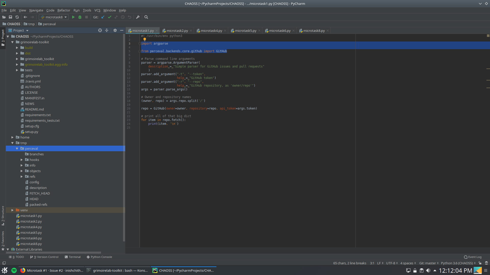

> Set up Perceval to be executed from PyCharm.

### Method 1
Perceval can be set up to be executed by pycharm as shown [here.](https://stackoverflow.com/questions/26069254/importerror-no-module-named-bottle-pycharm)

Here's a screenshot from me:

### Method 2
Perceval can also be set up by installing perceval using pip in the virtual environment of our project. 
- Activate the virtual environment (`source path/to/venv/bin/activate`)
- `$ pip3 install perceval`

Running perceval through python 

Running perceval through the terminal

Additionally, the [grimoirelab-toolkit](https://github.com/chaoss/grimoirelab-toolkit) can be used for debugging and using functions for datetime, introspection and URIs. It can be imported as follows:
- Activate the virtual environment (`source path/to/venv/bin/activate`)
- cd to the project
- `git clone https://github.com/chaoss/grimoirelab-toolkit.git`
- cd to grimoirelab-toolkit
- Build using instructions [here](https://github.com/chaoss/grimoirelab-toolkit#installation)

The project structure looks like this after doing everything above:

For running [the script](
        chaoss-microtasks/Microtask1/microtask1.py
      ) in this microtask yourself, clone this repo and run the script with a Github repo and token as arguments in the command line.

