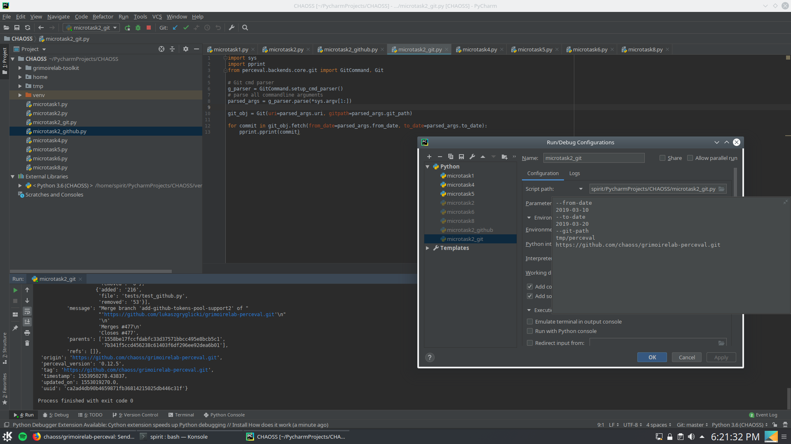
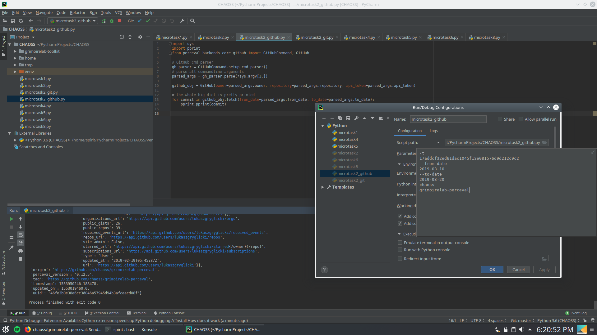

> Create a Python script to execute Perceval via its Python interface using the Git and GitHub backends. Feel free to select any target repository, for instance the GitHub repository hosting Perceval.

### Git

[Git script](
        chaoss-microtasks/Microtask2/microtask2_git.py
      ) 
which uses GitCommand to parse commandline arguments. The config is shown below:

      
### GitHub

[Github script](
        chaoss-microtasks/Microtask2/microtask2_github.py
      )
which uses GithubCommand to parse commandline arguments. The config is shown below:

To run the script, clone this repo and run it with the appropriate arguments.
