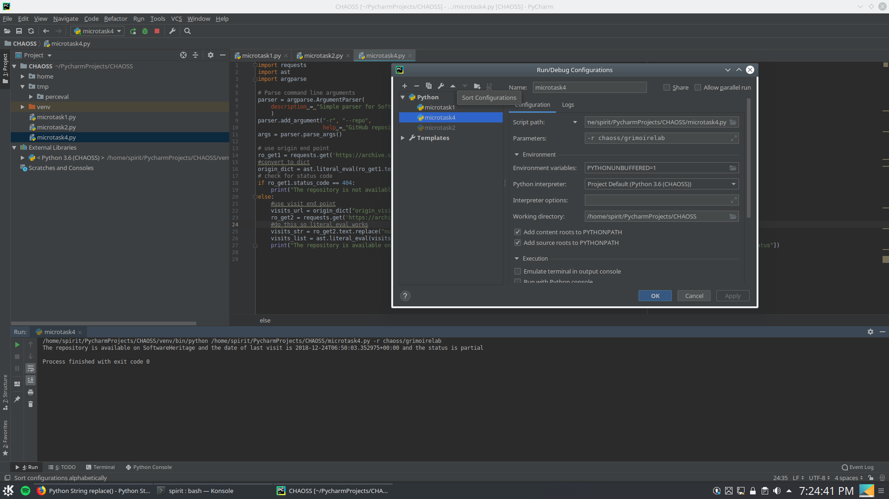
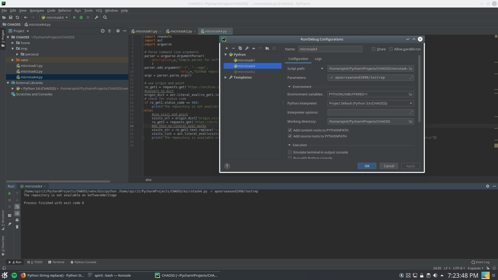

> Create a Python script to fetch data from SoftwareHeritage using its API.
Given a target GitHub repository, the script should return a message if the repository is not available on SoftwareHeritage or the date of the last visit.
The script should rely on the endpoints: origin and visits.
Please use the Python library requests to issue requests to the SofwareHeritage API.

[The script](https://github.com/apoorvaanand1998/chaoss-microtasks/blob/feedback1/Microtask4/microtask4.py) can be run by cloning this repo and running the script with a github repo as argument.

The config/output for when repo is available in SoftwareHeritage is:

The config/output for when repo is not available in SoftwareHeritage is:

