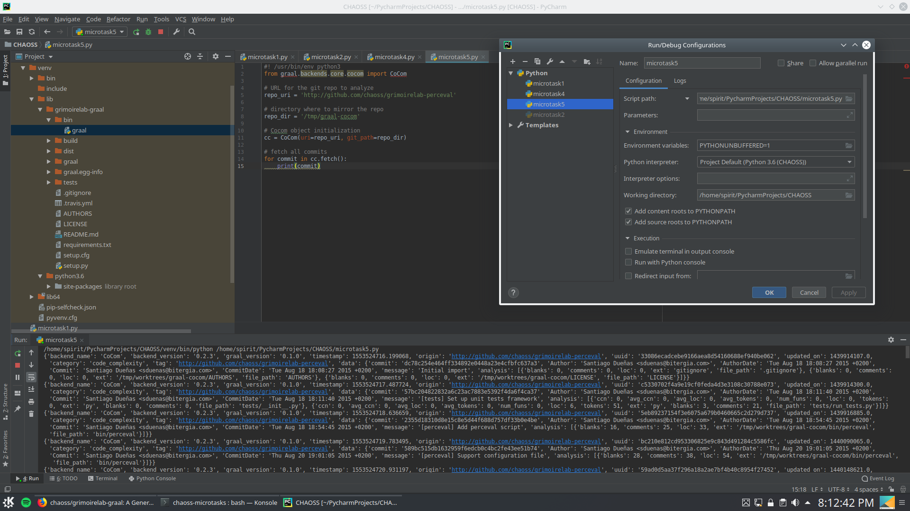
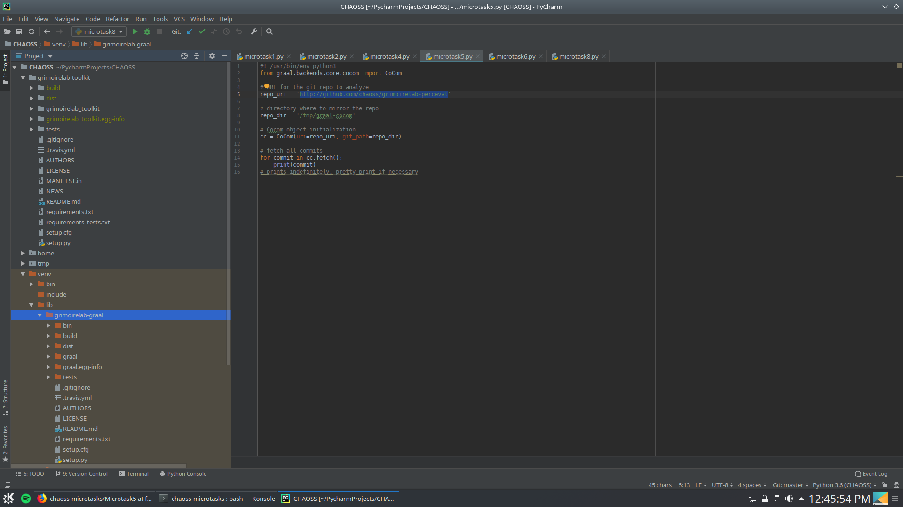

> Set up Graal to be executed from PyCharm.

Graal can be set up by activating the virtual environment that is project is in and running the following commands:
```
$> git clone https://github.com/chaoss/grimoirelab-graal.git
$> python3 setup.py build
$> python3 setup.py install
```

My script for this microtask can be found [here](https://github.com/apoorvaanand1998/chaoss-microtasks/blob/feedback1/Microtask5/microtask5.py)

The config file is as follows:



Additionally, [grimoirelab-toolkit](https://github.com/chaoss/grimoirelab-toolkit) can also be used here. The instructions are the same as in [Microtask 1](https://github.com/apoorvaanand1998/chaoss-microtasks/tree/feedback1/Microtask1).

The project structure is shown here :



The program can be found [here.](https://github.com/chaoss/grimoirelab-graal/blob/master/README.md#from-python)
