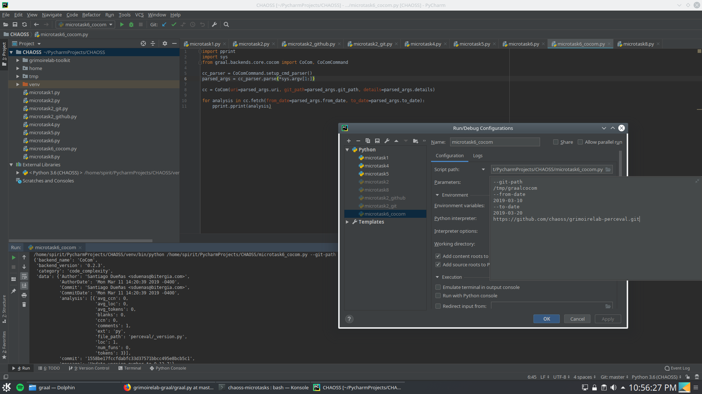
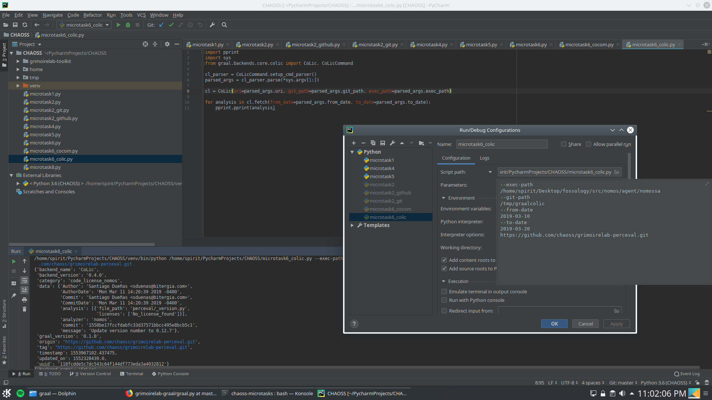

> Create a Python script to execute Graal via its Python interface using the CoCom and CoLic backends. Feel free to select any target repository, for instance the GitHub repository hosting Toolkit.

For CoLic backend, follow instructions [here.](https://github.com/chaoss/grimoirelab/issues/182#issuecomment-473536884)

### CoCom

[CoCom Script](https://github.com/apoorvaanand1998/chaoss-microtasks/blob/feedback1/Microtask6/microtask6_cocom.py) which uses the CoCom arg parser. The config is shown below:

### CoLic

[CoLic Script](https://github.com/apoorvaanand1998/chaoss-microtasks/blob/feedback1/Microtask6/microtask6_colic.py) which uses the CoLic arg parser. The config is shown below:

To run the script, clone the repo and run with appropriate arguments.
