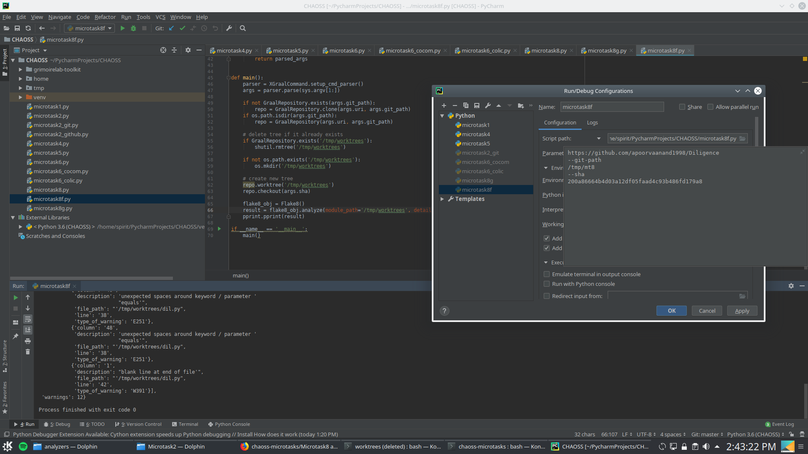

> Create a Python script to execute flake8 for a given commit of any Git repository. Given a commit SHA and a Git repository, the script should clone the repository (if it doesn't exist locally), perform a checkout based on the commit SHA and execute flake8 on that checkout. The script should return a message that either lists the errors found or "OK" if flake8 successfully ended.

[Here](https://github.com/apoorvaanand1998/chaoss-microtasks/issues/9) I got some help with taking the SHA input through the commandline. After using the modified parser to take in the inputs, I have used the flake8 analyzer to analyze the worktree in [my script.](https://github.com/apoorvaanand1998/chaoss-microtasks/blob/feedback1/Microtask8/microtask8.py)

The config/output is shown below: 

