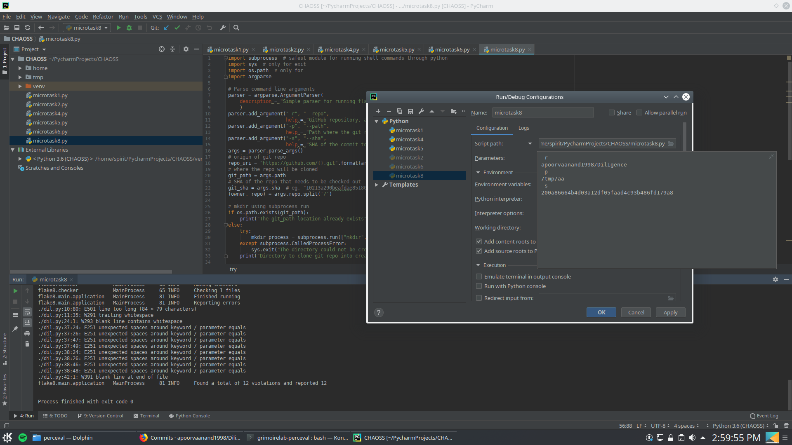

This one was pretty fun :)

To run the script, clone the repo and run the script with a github repo, SHA and git_path as argument. 

The config/output is shown below: 

The explanation for the program is all in the comments.
